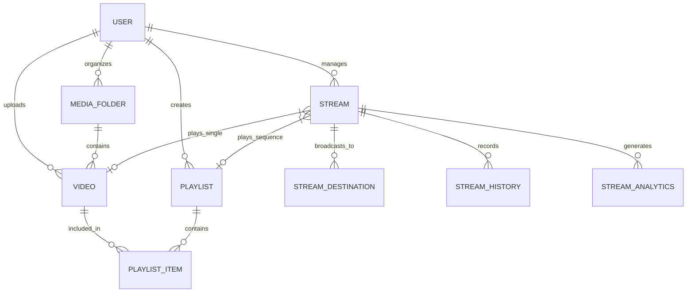

# Domain Model

**Version:** 3.3.0
**Last Updated:** 2026-07-19

## Overview

The StreamFlow domain is centered around taking media assets (Videos, Playlists) and broadcasting them to external platforms (Destinations) via configured routing rules (Streams).

---

## Core Entities

### User
The primary actor in the system. A user owns videos, folders, playlists, and streams. Authentication is handled via session tokens.

### Video
An uploaded media file. Has extracted metadata (duration, resolution, bitrate, fps) and an auto-generated thumbnail. Videos can be organized into Media Folders.

### Playlist
An ordered collection of `PlaylistItems` (which wrap Videos). Allows a stream to play multiple videos sequentially without interruption. Can optionally include background audio tracks.

### Stream
The central configuration unit for a broadcast. A stream acts as the source definition. It points to either a single Video or a Playlist. It defines base encoding parameters (bitrate, resolution, fps). A stream has a lifecycle state (`offline`, `streaming`, `scheduled`, `error`).

### Stream Destination
A target platform (YouTube, Twitch, Custom RTMP) attached to a Stream. As of v3.3.0, destinations can specify their own override encoding parameters. If left empty/zero, they inherit from the parent Stream.

---

## Relationships

---

## Domain Lifecycle: The Stream

1. **Configuration:** A user creates a `Stream`, linking it to a `Video` (or `Playlist`). They add one or more `Stream Destinations`.
2. **Scheduling (Optional):** A user sets a `schedule_time`. The background scheduler picks it up when the time arrives.
3. **Execution:** The backend launches FFmpeg.
    - If all destinations match the source encode (or have no overrides), a `tee` muxer is used (allCopy routing).
    - If overrides exist, multiple transcoding pipelines are launched.
4. **Monitoring:** During execution, FFmpeg stderr is parsed in real-time. Metrics populate the in-memory `healthStore`, and raw logs are pushed to the `LogBuffer`. Both are streamed to the UI via SSE.
5. **Termination:** The stream ends (either manually stopped, or the source media finishes without a fallback loop). The process is killed, state is updated to `offline`, and a `Stream History` record is finalized.
